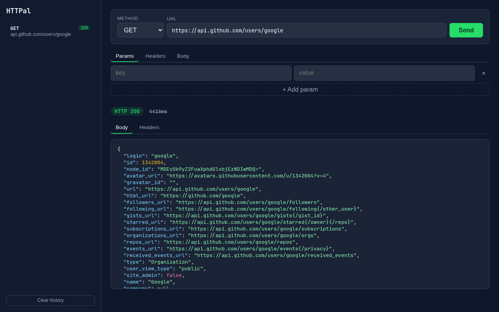

# HTTPal

[](https://github.com/ashusevim/httpal/actions/workflows/ci.yml)
[](https://www.npmjs.com/package/@ashusevim/httpal)
[](LICENSE)

A curl-like HTTP client that fits in a single npm package: zero runtime dependencies, a developer-tools timing waterfall, watch mode with live diffs, snapshot regression checks, and a built-in web UI. Written in strict TypeScript on Node 18+.




## 60-second start

```bash
npm install -g @ashusevim/httpal
httpal https://api.github.com/users/google
```

> Don't want to install? `npx @ashusevim/httpal https://api.github.com/users/google`

## Why HTTPal

|                        | curl | HTTPie | xh | **HTTPal** |
|------------------------|:----:|:------:|:--:|:----------:|
| JSON pretty-print      |  ✗   |   ✓    |  ✓ |    ✓       |
| Timing waterfall       | raw flags | ✗ | ✗ | **`--timing`** |
| Watch mode + live diff |  ✗   |   ✗    |  ✗ | **`--watch`** |
| Snapshot regression    |  ✗   |   ✗    |  ✗ | **`--snapshot`** |
| Built-in web UI        |  ✗   |   ✗    |  ✗ | **`httpal ui`** |
| Sanitizes output by default | ✗ | ✗ | ✗ | ✓ |
| Runtime dependencies   | —    | Python | Rust | **none (pure Node)** |

## Usage

```bash
httpal <url>                                  # GET
httpal -X POST --json '{"a":1}' <url>         # POST JSON (Content-Type set for you)
httpal -v -H "Accept: application/json" <url> # verbose request/response headers
httpal --fail -o user.json <url>              # exit 1 on HTTP >= 400, save body
httpal --timing <url>                         # DNS/TCP/TLS/TTFB/download waterfall
httpal --watch 2000 <url>                     # re-run, show only what changed
httpal --snapshot save <url>                  # record baseline
httpal --snapshot diff <url>                  # exit 1 if the response drifted
httpal ui --port 4242                         # web UI at http://localhost:4242
httpal tui                                    # interactive terminal mode
```

### Timing waterfall

```
Timing (total 17.9ms):
  DNS lookup          0ms  █
  TCP connect         0ms  █
  TLS handshake       0ms  █
  Wait (TTFB)       5.3ms  ██████████████████████████████
  Download          4.8ms  ███████████████████████████
```

### Snapshot diff example

```
--- diff vs snapshot from 2026-10-02T08:00:00.000Z ---
~ login: "google" -> "google-corp"
+ verified: true
```

## Options

| Flag | Description |
|------|-------------|
| `-X, --method <m>` | HTTP method (default `GET`, `POST` when a body is set) |
| `-H, --header <h>` | Header, e.g. `-H "Accept: application/json"` (repeatable) |
| `-d, --data <body>` | Request body, sent as-is |
| `--json <body>` | Request body; sets `Content-Type: application/json` if unset |
| `-v, --verbose` | Print request and response headers |
| `-i, --include` | Include response headers in output |
| `-t, --timeout <ms>` | Request timeout (default 30000) |
| `-o, --output <file>` | Write body to a file |
| `--timing` | Timing waterfall |
| `--watch <ms>` | Re-run every N ms, print diff |
| `--snapshot <save\|diff>` | Baseline record / compare |
| `--raw` | Disable sanitization of response bodies |
| `-L, --no-follow` | Do not follow redirects |
| `--fail` | Exit 1 on HTTP status >= 400 |
| `--target <url>` | URL (alternative to positional arg) |
| `-h, --help` / `--version` | Help / version |

Exit codes: `0` success · `1` request/HTTP error · `2` bad arguments.

## Docker

```bash
docker build -t httpal .
docker run --rm httpal https://api.github.com/users/google
```

## Development

```bash
git clone https://github.com/ashusevim/httpal.git
cd httpal
npm install
npm run build
npm test          # vitest: unit, client integration, CLI end-to-end, UI server
npm run typecheck
```

```
src/
  args.ts       argument parsing (no external deps)
  client.ts     fetch wrapper: timeout, redirects, error normalization, timing
  format.ts     status line, headers, JSON pretty-print, waterfall render
  diff.ts       JSON-aware structural diff (--watch, --snapshot)
  sanitize.ts   ANSI/control-char stripping for untrusted bodies
  snapshot.ts   baseline persistence
  ui-server.ts  local web UI server
  ui-page.ts    embedded single-page UI
  tui.ts        interactive terminal mode
  index.ts      CLI entry point
tests/          vitest suites
```

## Roadmap

- [ ] Cookie jar support
- [ ] Config file (`~/.httpalrc`) for default headers
- [ ] Shell completions
- [ ] OAuth helper flows

## License

ISC — see [LICENSE](LICENSE).
